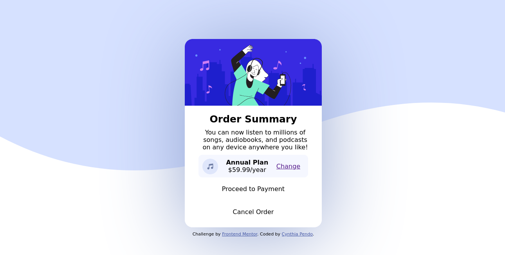

# Frontend Mentor - Order summary card solution

This is a solution to the [Order summary card challenge on Frontend Mentor](https://www.frontendmentor.io/challenges/order-summary-component-QlPmajDUj).  

## Table of contents

- [Overview](#overview)
- [The challenge](#the-challenge)
- [Screenshot](#screenshot)
- [Built with](#built-with)
- [Author](#author)

## Overview

The purpose of this project is to create a design as similar as possible to the provided templates to help improve your coding skills by your ability to build realistic projects.

### The challenge

Users should be able to:

- See hover states for interactive elements

### Screenshot

### Built with

- Semantic HTML5 markup
- CSS custom properties
- Flexbox

## Author

Cynthia Pendo

